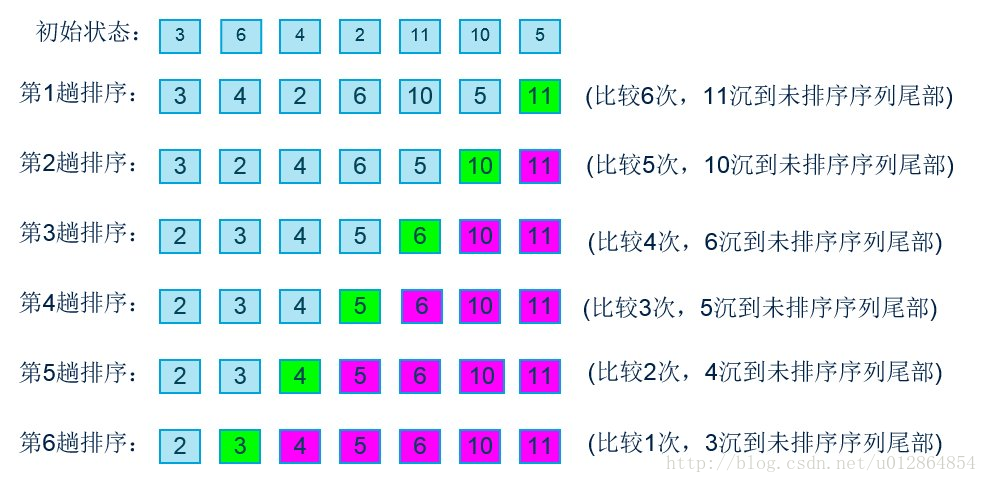
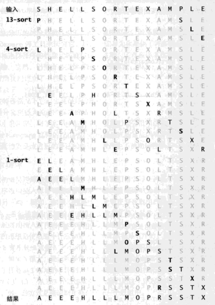
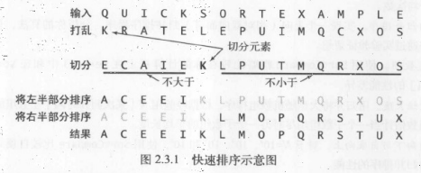
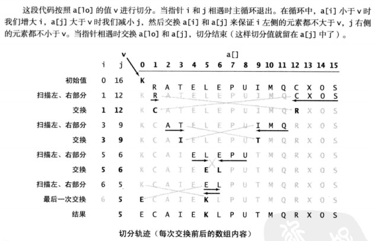

# 排序算法
## 排序模板
[排序模板代码](../src/main/java/lin/xc/coding/skill/algorithm/sort/Example.java)
## 选择排序
种最简单的排序算法是这样的：首先，找到数组中最小的那个元素，其次，将它和数组的第一个元素交换位置（如果第一个元素就是最小元素那么它就和自
己交换）。再次，在剩下的元素中找到最小的元素，将它与数组的第二个元素交换位置。如此往复，直到将整个数组排序。这种方法叫做选择排序，因为它
在不断地选择剩余元素之中的最小者。

总的来说，选择排序是一种很容易理解和实现的简单排序算法，它有两个很鲜明的特点：
- 运行时间和输入无关。为了找出最小的元素而扫描一遍数组并不能为下一遍扫描提供什么信息。这种性质在某些情况下是缺点，因为使用选择排序的人可
  能会惊讶地发现，一个已经有序的数组或是主键全部相等的数组和一个元素随机排列的数组所用的排序时间竟然一样长！我们将会看到，其他算法会更善
  于利用输入的初始状态。
- 数据移动是最少的。每次交换都会改变两个数组元素的值，因此选择排序用了N次交换一一交换次数和数组的大小是线性关系。我们将研究的其他任何算法
  都不具备这个特征（大部分的增长数量级都是线性对数或是平方级别）。

[选择排序代码示例](../src/main/java/lin/xc/coding/skill/algorithm/sort/Selection.java)

## 冒泡排序
大学时期，最熟识的就是冒泡排序，冒泡排序（Bubble Sort，译为：泡沫排序或气泡排序，比较相邻的两个，从左到右，大的往后放，第二轮继续，但是第一轮比较出的最大值不参与第二轮的比较）是一种简单的排序算法。
它重复地走访过要排序的数列，一次比较两个元素，如果他们的顺序错误就把他们交换过来。走访数列的工作是重复地进行直到没有再需要交换，也就是说该数列已经排序完成。
这个算法的名字由来是因为越大的元素会经由交换
慢慢“浮”到数列的顶端，故名。
 1、比较相邻的元素。如果第一个比第二个大（小），就交换他们两个。
 2、对每一对相邻元素作同样的工作，从开始第一对到结尾的最后一对。这步做完后，最后的元素会是最大（小）的数。
 3、针对所有的元素重复以上的步骤，除了最后已经选出的元素（有序）。
 4、持续每次对越来越少的元素（无序元素）重复上面的步骤，直到没有任何一对数字需要比较，则序列最终有序。

## 插入排序
通常人们整理桥牌的方法是一张一张来，将每一张牌插入到其它已经有序的牌中的位置。在计算机的实验中，为了给要插入的元素腾出空间，我们需要将其余所有元素在插入之前都向右移动一位。这种算法叫做插入排序。
（即先保证前两个有序；第三个当插入的元素，然后前三个排序，保证前三个有序；接着对于前三个来说，第四个插入前三个有序的，再保证前四个有序……以此类推！）

与选择排序一样，当前索引左边的所有元素都是有序的，但它们的最终位置还不确定，为了给更小的元素腾出空间，它们可能会被移动。但是当索引到达数组的右端时，数组排序就完成了。

和原则排序不同，插入排序所需要的时间取决于输入中元素的初始顺序。例如，对一个很大且其中的元素已经有序（或接近有序）的数组进行排序将会比对随机顺序的数组进行排序要快得多。

[插入排序代码示例](../src/main/java/lin/xc/coding/skill/algorithm/sort/Insertion.java)

## 希尔排序
为了展示初级排序算法性质的价值，接下来我们将学习一种基于插入排序的快速的排序算法。对于大规模乱序数组插入排序很慢，因为它只会交换相邻的元素，
因此元素只能一点一点地从数组的一端移动到另一端。例如，如果主键最小的元素正好在数组的尽头，要将它挪到正确的位置就需要N－1次移动。
 希尔排序为了加快速度简单地改进了插入排序，交换不相邻的元素以对数组的局部进行排序，并最终用插入排序将局部有序的数组排序。

希尔排序的思想是使数组中任意间隔为h的元素都是有序的。这样的数组被称为h有序数组。换句话说，一个h有序数组就是h个互相独立的有序数组编织在一
起组成的一个数组。在进行排序时，如果h很大，我们就能将元素移动到很远的地方，为实现更小的h有序创造方便。用这种方式，对于任意以1结尾的h序列，
我们都能够将数组排序。这就是希尔排序。已下算法的实现使用了序列1／2（3－1），从N3开始递减至1。我们把这个序列称为递增序列。下面的算法实时计
算了它的递增序列，另一种方式是将递增序列存储在一个数组中。

[希尔排序代码示例](../src/main/java/lin/xc/coding/skill/algorithm/sort/Shell.java)
> Sedgewick提出了几种增量序列，其最坏情形运行时间为O（n^1.3）,其中最好的一个序列是{1,5,19,41,109,…}

上述连接例子对应轨迹图：

## 归并排序
将两个有序的数组归并成一个更大的有序数组，很快人们就根据这个操作发明了一种简单的递归排序算法：归并排序。要将
一个数组排序，可以先(递归地)将它分成两半分别排序，然后将结果归并起来。你将会看到，归并排序最吸引人的性质是它能够保证将任意长度为N的数组
排序所需时间和NlogN成正比；它的主要缺点则是它所需的额外空间和N成正比。简单的归并排序如下图所示：

[归并排序代码示例](../src/main/java/lin/xc/coding/skill/algorithm/sort/Merge.java)

## 快速排序
快速排序是一种分治的排序算法。它将一个数组分成两个子数组，将两部分独立地排序。快速排序和归并排序是互补的：归并排序是将数组分成两个子数组
分别排序，并将有序的子数组归并以将整个数组排序，而快速排序将数组排序的方式则是当两个子数组都有序时整个数组也就自然有序了，归并排序的递归
调用发生在处理整个数组之前（先颗粒度变小，再处理子数组排序），而快速排序的地柜调用则发生在处理数组之后（先处理排序-但并不是整个数组都处理好，然后颗粒度变小）。

快速排序的基本思想是：
- 先从数列中选出一个数作为基准数
- 分区过程中，将比基准数小的数放在基准数的左边，比基准数大的数放在基准数的右边
- 再对左右两边分区重复第二个操作，直到各区间只剩一个数

[快速排序代码示例](../src/main/java/lin/xc/coding/skill/algorithm/sort/Quick.java)

示例中的partition方法执行过程图如下：

- **原地切分**
 如果使用一个辅助数组，我们可以很容易实现切分，但将切分后的数组复制回去的开销也许会使我们得不偿失。
一个初级java程序员甚至可能会将空数组创建在递归的切分方法中，这会大大降低排序的速度。
- **别越界**
 如果切分元素是数组中最小或最大的那个元素，我们就要小心别让扫描指针跑出数组的边界。partition()实现可进行明确的检测来预防这种情况。
测试条件（j == lo）是冗余的，因为切分元素就是a[lo]，它不可能比自己小。数组右端也有相同的情况，它们都是可以去掉的。
- **保持随机性**
 数组元素的顺序是被打乱过的。因为快速排序算法对所有的子数组都一视同仁，它的所有子数组也都是随机排序的。这对于预测算法的运行时间很重要。
保持随机性的另一种方法是在partition()中随机选择一个切分元素。
- **终止循环**
 一个最常见的错误是没有考虑到数组中可能包含和切分元素的值相同的其他元素。
- **处理切分元素值有重复的情况**
 左侧扫描最好是在遇到大于等于切分元素值的元素时停下，右侧扫描则是遇到小于等于切分元素值的元素时停下。
尽管这样可能会不必要地将一些等值的元素交换，但在某些典型应用中，它能够避免算法的运行时间变为平方级别。
- **终止递归**
 例如，实现快速排序时一个常见的错误就是不能保证将切分元素放入正确的位置，从而导致程序在切分元素正好是子数组的最大或是最小元素时陷入了无限的递归循环之中。